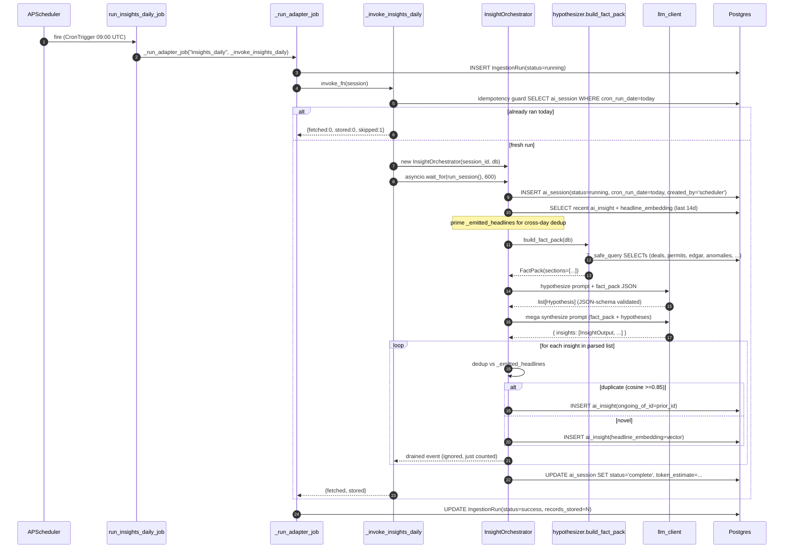
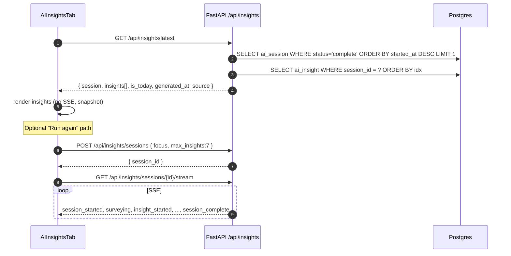

# Architecture: AI Insights Automation & Real-Data Synthesis

**Status:** Draft v1 (architect output, no code)
**Owner:** Architecture
**Date:** 2026-05-04
**Predecessors:** `01-prd.md` (PRD), `02-research.md` (research §G recommendations table)
**Implementation target:** v1 of the daily auto-run AI Insights pipeline

> Read this in tandem with the PRD acceptance criteria (AC1-AC9) and the
> research §G recommendations table. Where this doc says "the architect's
> call", that decision is recorded inline in §10 (Decision Log).

---

## 1. System Overview

The AI Insights tab today has all infrastructure (orchestrator, SSE
protocol, persistence, frontend renderer) but is non-functional because:

1. The synthesis loop is not grounded in real rows — `_phase_bootstrap_iter`
   discards rows after counting them, `_phase_hypothesize_iter` is a stub,
   and the synthesis call site hardcodes the literal string
   `"Candidate insight #{idx + 1} from session bootstrap."` and passes
   `supporting_rows=[]`.
2. Nothing schedules a run. The tab waits for a click and there is no
   `insights_daily` job in `JOB_CONFIG`.

The v1 architecture closes both gaps with the **smallest possible new
surface area**, mirroring the in-tree precedent set by
`backend/agents/weekly_brief.py`. The shape is:

- **Hypothesizer (new module)** runs ~7 deterministic SQL queries against
  Postgres and assembles a `FactPack` JSON object whose rows carry stable
  ids the synthesizer can cite.
- **Orchestrator (rewrite)** drops bootstrap survey-endpoint scraping in
  favour of the FactPack, replaces the hypothesize stub with a single
  LLM call that produces typed `Hypothesis` objects, and rewrites the
  synthesis loop to pass real `supporting_rows` per insight.
- **Mega synthesis call** (research §A.2 / §C.3): one LLM call produces
  all 5-7 insights as a JSON-schema list; the orchestrator fans the
  result out as per-insight SSE events so the UI is unaffected.
- **Cross-day dedup (pgvector)**: at session start, prime
  `_emitted_headlines` from the last 14 days of `ai_insight` rows whose
  session was successful.
- **Scheduler integration**: a new `insights_daily` job in `JOB_CONFIG`
  fires once per UTC day at 09:00, drains the orchestrator iterator,
  records an `IngestionRun` audit row, and is wrapped with an outer
  `asyncio.wait_for(timeout=600)` guard.
- **`GET /api/insights/latest`** lets the frontend default-load the most
  recent successful session without a click.
- **Frontend**: AIInsightsTab calls `/api/insights/latest` on mount,
  renders the result, and demotes the "Generate insights" CTA to a
  header-utility "Run again" button.

---

## 2. Component & Sequence Diagrams

### 2.1 Component diagram

```
                +-------------------------------------+
                |   APScheduler (AsyncIOScheduler)    |
                |   SQLAlchemyJobStore (Postgres)     |
                |   EVENT_JOB_ERROR / _MISSED listen. |
                +------------------+------------------+
                                   |
              09:00 UTC daily      | run_insights_daily_job()
                                   v
                +-------------------------------------+
                |  _run_adapter_job("insights_daily") |
                |  - opens AsyncSession               |
                |  - creates IngestionRun(running)    |
                |  - asyncio.wait_for(..., 600s)      |
                +------------------+------------------+
                                   |
                                   v
                +-------------------------------------+
                |  _invoke_insights_daily(session)    |
                |  1. idempotency guard (skip if      |
                |     scheduler row exists today)     |
                |  2. construct InsightOrchestrator   |
                |  3. async for ev in run_session():  |
                |       count InsightCompleteEvent    |
                |  4. return {fetched, stored}        |
                +------------------+------------------+
                                   |
                                   v
+------------------------------------------------------------+
|                  InsightOrchestrator                       |
|                                                            |
|   _phase_bootstrap_iter ----> hypothesizer.build_fact_pack |
|        (drops survey endpoint scrape; calls new module)    |
|                              |                             |
|                              v                             |
|                     +-----------------+                    |
|                     |   FactPack      |  Pydantic          |
|                     |   sections[]    |  rows w/ row_ids   |
|                     +--------+--------+                    |
|                              |                             |
|   _phase_hypothesize_iter ---+---> 1 LLM call              |
|        (replaces stub)            list[Hypothesis]         |
|                                                            |
|   _phase_verify_and_synthesize_iter                        |
|        (rewrites lines 395-403)                            |
|        - mega LLM call (1x) over fact_pack +               |
|          hypotheses -> { insights: [...] }                 |
|        - per-insight SSE event fan-out                     |
|        - cross-day dedup via _emitted_headlines            |
|        - persist AIInsight rows                            |
+-----------------------+------------------------------------+
                        |
                        v
  +-----------------------------------------------------------+
  | Postgres                                                  |
  |   ai_session (status, cron_run_date, token_estimate)      |
  |   ai_insight (headline_embedding=vector(3072),            |
  |               ongoing_of_id FK)                           |
  |   ingestion_runs (audit)                                  |
  |   agent_message / agent_tool_call / agent_chart           |
  +-----------------------------------------------------------+
                        ^
                        |
+---------------------- + ----------------------+
|                                               |
|    GET /api/insights/latest (NEW)             |
|    POST /api/insights/sessions (existing)     |
+----------------------+------------------------+
                       |
                       v
        +--------------------------------+
        |  AIInsightsTab.tsx             |
        |    onMount: GET /latest        |
        |    "Run again" -> POST/sessions|
        +--------------------------------+
```

### 2.2 Sequence: daily scheduled run (no client)



### 2.3 Sequence: user opens the tab



---

## 3. New Module: `backend/agents/insights/hypothesizer.py`

### 3.1 Public API

```text
async def build_fact_pack(db: AsyncSession) -> FactPack
```

Single entrypoint. Pure read function. Returns a Pydantic
`FactPack` whose row_ids are stable strings of the form
`"{section}:{n}"` (e.g. `"top_capacity_movers_24h:3"`) so the
synthesizer can cite them by id.

### 3.2 Pydantic data model

```text
class FactRow(BaseModel):
    row_id: str                  # e.g. "top_capacity_movers_24h:3"
    entity: str | None           # company / site name
    metric: str | None           # e.g. "capacity_mw", "permits"
    value: float | int | str | None
    delta: float | None          # week-over-week or 24h change
    source_url: str | None       # for citation pills
    detail: dict[str, Any] = {}  # adapter-specific extras (kept tight)

class FactSection(BaseModel):
    name: str
    description: str             # one-line; passed to LLM
    rows: list[FactRow] = []
    error: str | None = None     # set when _safe_query swallows

class FactPack(BaseModel):
    generated_at: datetime
    sections: list[FactSection]

    def lookup(self, row_ids: list[str]) -> list[FactRow]: ...
    def to_compact_json(self) -> str: ...      # for prompt embedding
    def total_rows(self) -> int: ...
```

`lookup()` is called by the orchestrator after the LLM returns
hypotheses with `row_ids` so synthesis receives the actual row
dicts, not just the ids.

### 3.3 Sections (refining research §A.3)

The research recommended 7. Confirmed list, all bounded by
`FACT_PACK_MAX_ROWS_PER_SECTION = 12`:

| # | section name                   | source table(s)                                  | filter                                          | row dict keys                                                         |
|---|-------------------------------|---------------------------------------------------|-------------------------------------------------|-----------------------------------------------------------------------|
| 1 | `top_capacity_movers_24h`     | `EnergyProject` joined to `Site`                  | `created_at >= now()-24h` OR updated 24h        | entity=project_name, metric="contracted_mw", value, delta=null, source_url |
| 2 | `new_permits_24h`             | `Event` (event_type IN permit types)              | `event_date >= today-1d`                        | entity=site or county, metric="permit_status", value=event_type, source_url |
| 3 | `anomalies_today`             | `Anomaly`                                         | `flagged_at::date = current_date`               | entity=metric_label, metric=metric_key, value=actual, delta=z_score, source_url=null |
| 4 | `edgar_capacity_mentions_7d`  | `EdgarExtraction`                                 | `filing_date >= now()-7d AND capacity_mw IS NOT NULL` | entity=buyer_raw, metric="capacity_mw", value=capacity_mw, source_url=edgar_url |
| 5 | `epa_echo_new_records_24h`    | `Event` (event_type='epa_air_permit')             | `created_at >= now()-24h`                       | entity=facility, metric="permit_class", value, source_url               |
| 6 | `coverage_gaps`               | `DataCoverage`                                    | `status = 'partial'` OR stale > SLA             | entity=pillar_state_source, metric="freshness_hours", value=hours_since, source_url=null |
| 7 | `top_companies_by_delta_7d`   | `EnergyProject` aggregate                         | rolling 7d sum vs prior 7d sum                  | entity=parent_company, metric="capacity_mw_delta", value=current, delta=delta, source_url=null |

Each section query is wrapped in a `_safe_query`-style try/except
that mirrors `weekly_brief._safe_query`: on any exception the
section is marked with `error=<short>` and `rows=[]` rather than
poisoning the whole pack.

### 3.4 SQL skeletons

These are intent-level, not literal code. The implementer should
prefer SQLAlchemy ORM equivalents over raw SQL where the model is
already defined.

```text
# Section 1
SELECT id, project_name, parent_company_id, tot_contracted_power_mw, state_code
  FROM energy_projects
 WHERE created_at >= NOW() - INTERVAL '24 hours'
    OR updated_at >= NOW() - INTERVAL '24 hours'
 ORDER BY tot_contracted_power_mw DESC NULLS LAST
 LIMIT 12;

# Section 2 (new_permits_24h)
SELECT id, event_type, event_date, event_description, source_url, site_id
  FROM events
 WHERE event_type IN ('building_permit_filed','building_permit_issued','epa_air_permit')
   AND event_date >= CURRENT_DATE - INTERVAL '1 day'
 ORDER BY event_date DESC
 LIMIT 12;

# Section 3 (anomalies_today)
SELECT id, metric_key, entity_label, observed_value, z_score, flagged_at
  FROM anomalies
 WHERE flagged_at::date = CURRENT_DATE
 ORDER BY ABS(z_score) DESC
 LIMIT 12;

# Section 4 (edgar_capacity_mentions_7d)
SELECT id, buyer_raw, seller_raw, capacity_mw, filing_date, edgar_url, excerpt
  FROM edgar_extractions
 WHERE filing_date >= NOW() - INTERVAL '7 days'
   AND capacity_mw IS NOT NULL
 ORDER BY capacity_mw DESC
 LIMIT 12;

# Section 5 (epa_echo_new_records_24h)
SELECT id, event_description, event_date, source_url
  FROM events
 WHERE event_type = 'epa_air_permit'
   AND created_at >= NOW() - INTERVAL '24 hours'
 LIMIT 12;

# Section 6 (coverage_gaps)
SELECT id, pillar, state_code, source, status, last_ingested_at, freshness_sla_hours
  FROM data_coverage
 WHERE status = 'partial'
    OR (last_ingested_at IS NOT NULL
        AND last_ingested_at < NOW() - (freshness_sla_hours || ' hours')::interval)
 ORDER BY last_ingested_at NULLS FIRST
 LIMIT 12;

# Section 7 (top_companies_by_delta_7d)
WITH curr AS (
  SELECT parent_company_id, SUM(tot_contracted_power_mw) AS mw
    FROM energy_projects
   WHERE created_at >= NOW() - INTERVAL '7 days'
   GROUP BY parent_company_id
), prior AS (
  SELECT parent_company_id, SUM(tot_contracted_power_mw) AS mw
    FROM energy_projects
   WHERE created_at >= NOW() - INTERVAL '14 days'
     AND created_at <  NOW() - INTERVAL  '7 days'
   GROUP BY parent_company_id
)
SELECT c.parent_company_id, c.mw AS curr_mw, COALESCE(p.mw,0) AS prior_mw,
       c.mw - COALESCE(p.mw,0) AS delta
  FROM curr c LEFT JOIN prior p USING (parent_company_id)
 ORDER BY delta DESC
 LIMIT 12;
```

### 3.5 Error policy

- Each section is wrapped in `try/except Exception` and a logger
  warning at `WARNING` level with `extra={"section": name, "err": str(exc)}`.
- A section with an exception is still added to the pack with
  `error="<class>:<truncated msg>"` and `rows=[]`. The synthesis
  prompt is told "if a section is empty or errored, ignore it"
  rather than failing the whole run.
- A FactPack with `total_rows()==0` short-circuits the orchestrator
  to emit a `status=succeeded_empty` session (PRD R5 mitigation,
  architect's choice — see Decision Log §10 D6).

### 3.6 Cap matrix

| Cap                            | Value | Rationale                              |
|--------------------------------|-------|----------------------------------------|
| `FACT_PACK_MAX_ROWS_PER_SECTION` | 12    | research §C.4                          |
| `FACT_PACK_MAX_TOTAL_ROWS`     | 60    | hard input bound on synthesis prompt   |
| Section count                  | 7     | per §3.3 above                         |
| Per-row JSON budget            | ~30 t | research §C.2 estimate                 |

---

## 4. Orchestrator Rewrite (file-and-line diff plan)

All line numbers below are from the current file
`backend/agents/insights/orchestrator.py` (HEAD, May 2026). They are
*targets*, not literal patches.

### 4.1 Constructor / state (line 143-168)

- Confirm `self.db` is set in `__init__` *before* `run_session` is
  ever entered (it already is). No constructor signature change.
- Add new private state:
  - `self._fact_pack: FactPack | None = None`
  - `self._hypotheses: list[Hypothesis] = []`
  - `self._token_estimate: int = 0`

### 4.2 Session-start dedup priming (after line 167)

Right after `self._emitted_headlines: list[tuple[str, list[float]]] = []`:

- Insert a constructor-time placeholder `self._cross_day_priming_done = False`
- In `run_session`, immediately after `_persist_session_start` (current
  line 208), call:
  ```text
  await self._prime_cross_day_dedup()
  ```
- New helper `_prime_cross_day_dedup()`:
  - Calls `dedup.fetch_recent_embeddings(self.db, since=now-14d)` (new
    function in `dedup.py`).
  - Returns `list[(headline_str, list[float])]` — feed straight into
    `self._emitted_headlines`.
  - Wrapped in try/except `Exception` so a vector-cast failure cannot
    crash the run; logs a warning if it fails.
  - Emits one `ReasoningStepEvent(step="dedup_primed", insight_id="session")`.

### 4.3 `_phase_bootstrap_iter` (line 279) — full replacement

The current bootstrap hits 8 survey HTTP endpoints. Replace with:

- `import` line (top of method):
  `from .hypothesizer import build_fact_pack`
- Body:
  1. `self._fact_pack = await build_fact_pack(self.db)`
  2. Emit one `ReasoningStepEvent(step="bootstrap")` whose
     `insight_id="session"` payload describes what loaded:
     `f"Loaded {self._fact_pack.total_rows()} rows across {len(self._fact_pack.sections)} sections"`.
     Use the existing `ReasoningStepData` shape — no protocol change.
  3. Emit a single `SurveyingEvent` with `candidates_seen=
     self._fact_pack.total_rows()` so the existing UI banner
     ("Surveying the platform…") renders without modification.
  4. Emit a `PingEvent` (mirror current line 337).

The 8 `call_api` survey endpoints in `SURVEY_ENDPOINTS` (lines 90-99)
are no longer used by the bootstrap phase. Keep the constant in the
file (some tests import it) but mark it deprecated via a docstring
comment.

### 4.4 `_phase_hypothesize_iter` (line 339) — replace stub

Current body just emits `ReasoningStepEvent(step="hypothesize")` and
returns. Replace with:

1. If `self._fact_pack is None or self._fact_pack.total_rows() == 0`,
   emit a single reasoning step `step="no_data"` and `return` — the
   verify+synth phase will see an empty hypothesis list and emit no
   insights, allowing `_persist_session_finish` to mark the session
   `status=complete, insights_emitted=0`.
2. Build a `HYPOTHESIZE_PROMPT` that contains:
   - System message: "You are a data analyst. Given a fact pack of
     recent rows from the OCI Datacenter & Power Intelligence
     Platform, propose 5-10 candidate insight hypotheses…"
   - User message: `self._fact_pack.to_compact_json()`
3. Call `self.llm.reason(...)` with `response_format={"type": "json_schema",
   "schema": HypothesesSchema}` where `HypothesesSchema` lives in
   `agents/insights/hypothesizer.py` next to `Hypothesis`.
4. Parse to `list[Hypothesis]` (each carries
   `headline_draft, supporting_row_ids: list[str], confidence_signal,
   needs_drilldown: bool`).
5. Truncate to `min(len(parsed), self.max_insights)` and assign to
   `self._hypotheses`.
6. Per hypothesis emit one `ReasoningStepEvent(step="hypothesize",
   insight_id=str(uuid4()))` so the UI's reasoning panel has a
   visible per-hypothesis trace. *Note*: these placeholder ids are
   distinct from the eventual insight ids minted in
   `_phase_verify_and_synthesize_iter`. The frontend's reasoning
   panel renders these without correlation; that is acceptable in v1.
7. Account `self._token_estimate += turn.tokens["prompt"] +
   turn.tokens["completion"]`.

### 4.5 `_phase_verify_and_synthesize_iter` (line 355) — mega-call rewrite

The single most consequential change. Today the function loops
`max_insights` times and calls `run_insight_synthesis` once per
iteration with a hardcoded hypothesis (line 398) and `supporting_rows=[]`
(line 399).

**Decision (§10 D2): use one mega LLM call.**

Replace the current loop with:

1. Pre-loop: if `self._hypotheses == []` return immediately (covers
   empty-fact-pack day from §4.4 step 1).
2. Build a single mega prompt that contains:
   - System: synthesis instructions, JSON-schema list output
   - User: compact JSON of `self._fact_pack` + the hypothesis list
3. Call `self.llm.reason(model=..., response_format={
   "type":"json_schema", "schema": MegaInsightsSchema })`. The schema
   is `{ insights: [InsightOutput, ...] }` with each
   `InsightOutput = { headline, body, confidence_signal,
   materiality, supporting_row_ids: list[str] }`.
4. **JSON-parse error policy:** on `json.JSONDecodeError` or schema
   validation error, retry exactly once with the same prompt. On the
   second failure, emit `ErrorEvent(code="synthesis_parse_failed")`
   and return — the session ends with `insights_emitted=0` and the
   tab shows the failure card.
5. Account `self._token_estimate += turn.tokens["prompt"] +
   turn.tokens["completion"]`.
6. **SSE fan-out loop** (preserves the existing per-insight UX):

   ```text
   for idx, insight_out in enumerate(parsed.insights[: self.max_insights]):
       insight_id = str(uuid.uuid4())
       yield InsightStartedEvent(...)
       yield ReasoningStepEvent(step="verify", insight_id=insight_id)

       # cross-day dedup
       supporting_rows = self._fact_pack.lookup(insight_out.supporting_row_ids)
       duplicate = await is_duplicate(insight_out.headline,
                                      self._emitted_headlines,
                                      cosine_threshold=V1_NOVELTY_COSINE_THRESHOLD)
       if duplicate:
           # NEW: persist with ongoing_of_id back-ref instead of dropping
           prior_id = await self._find_prior_insight_id(insight_out.headline)
           await self._persist_insight(..., ongoing_of_id=prior_id)
           yield InsightCompleteEvent(...)
           continue

       yield ReasoningStepEvent(step="emit", insight_id=insight_id)
       yield InsightCompleteEvent(headline=insight_out.headline,
                                  confidence=...,
                                  materiality=...,
                                  skills_run=["mega_synthesis"])

       # persist + remember headline (with embedding now, not [])
       embedding = await _embed_one(insight_out.headline)
       self._emitted_headlines.append((insight_out.headline, embedding))
       self._emitted_count += 1
       await self._persist_insight(insight_id=uuid.UUID(insight_id),
                                   idx=idx,
                                   headline=insight_out.headline,
                                   body=insight_out.body,
                                   confidence=...,
                                   materiality=...,
                                   skills_run=["mega_synthesis"],
                                   headline_embedding=embedding,
                                   supporting_row_ids=insight_out.supporting_row_ids)
   ```

7. **Remove** the existing call site at lines 395-403 (`run_insight_synthesis`
   with `hypothesis=f"Candidate insight #{idx+1}..."` and
   `supporting_rows=[]`). The skill is no longer the synthesis driver;
   it is replaced by the mega call.
8. **Keep** `_record_skill_invocation` so the audit trail still shows
   `skill_name="mega_synthesis"` rows in `skill_invocation`.

### 4.6 Persistence helper updates (`_persist_insight`, line 630)

- Add three nullable kwargs: `headline_embedding: list[float] | None`,
  `ongoing_of_id: uuid.UUID | None`, `supporting_row_ids: list[str] | None`.
- Write `headline_embedding` via raw SQL (`INSERT ... headline_embedding
  = :v::vector(3072)`) consistent with the existing migration comment
  on `ai_insight.headline_embedding`. After the schema migration in §5
  this becomes a direct column write.
- Write `supporting_row_ids` into the existing `agent_message`
  `event_payload` JSONB or a new `ai_insight.supporting_row_ids`
  column — see Decision Log §10 D7.

### 4.7 Session-finish accounting (line 264 / 586)

- `_persist_session_finish` already updates `status, finished_at,
  duration_ms, budget_status, insights_emitted`. Extend with:
  - `token_estimate=self._token_estimate`
  - `cron_run_date=current_date if filters.get("focus")=="daily-cron" else NULL`
- The `cron_run_date` field is the column the idempotency guard
  reads.

### 4.8 What does NOT change

- The SSE event taxonomy (research §G item 8 confirms zero protocol
  change; PRD NG5).
- The `to_sse_text` serializer.
- The agent_chart write path or the V2 chat flow.
- `cancel()` semantics.
- The `V1_TOOL_CALL_CAP=40` constant (it is unused by the new
  pipeline, but several tests reference it — keep).

---

## 5. Schema Changes (Alembic migration plan)

Two migrations, both additive. Numbering picks up after the most
recent version under `backend/alembic/versions/` (012 today), so
the new files are `013_*` and `014_*`.

### 5.1 Migration `013_ai_insight_embedding_vector.py`

**Goal:** convert `ai_insight.headline_embedding` from `Text` to
`vector(3072)`; add `ongoing_of_id`; add `ai_session.token_estimate`
and `ai_session.cron_run_date`.

`pgvector` does not provide a direct `Text -> vector` cast, so the
migration must drop and re-add the column. The existing column is
empty in any non-dogfood environment (the migration comment in
009 says "store as text in V1; dedup writes vector via raw SQL" and
no code currently writes to it), making this safe.

Upgrade sequence:

```text
# 1) ai_insight: replace headline_embedding column type
op.execute("ALTER TABLE ai_insight DROP COLUMN headline_embedding;")
op.execute("ALTER TABLE ai_insight ADD COLUMN headline_embedding vector(3072) NULL;")
# defer ivfflat/hnsw index until row count justifies it (research §G item 11)

# 2) ai_insight: ongoing-since back-ref
op.add_column(
    "ai_insight",
    sa.Column("ongoing_of_id", UUID(as_uuid=True),
              sa.ForeignKey("ai_insight.id", ondelete="SET NULL"),
              nullable=True),
)
op.create_index("ix_ai_insight_ongoing_of_id", "ai_insight", ["ongoing_of_id"])

# 3) ai_insight: optional supporting row id list (Decision D7)
op.add_column(
    "ai_insight",
    sa.Column("supporting_row_ids", JSONB(), nullable=True),
)

# 4) ai_session: token_estimate
op.add_column(
    "ai_session",
    sa.Column("token_estimate", sa.Integer(), nullable=True),
)

# 5) ai_session: cron_run_date (idempotency)
op.add_column(
    "ai_session",
    sa.Column("cron_run_date", sa.Date(), nullable=True),
)
op.create_index(
    "ix_ai_session_created_by_cron_run_date",
    "ai_session",
    ["created_by", "cron_run_date"],
)
```

**Downgrade** drops the new column types and recreates
`headline_embedding TEXT NULL`. Indices dropped first.

**Index strategy.** Following research §G item 11, defer pgvector
ANN indices (ivfflat/hnsw) until the table grows past ~500 rows.
Sequential scan over <500 vectors is well under 50 ms even at
3072 dims. Add a follow-up migration `014_ai_insight_hnsw.py` that
does:

```text
CREATE INDEX CONCURRENTLY ix_ai_insight_headline_embedding_hnsw
  ON ai_insight USING hnsw (headline_embedding vector_cosine_ops);
```

once the count justifies it. **Do not** include this in 013 — the
HNSW build briefly locks writes and is unnecessary for v1.

### 5.2 Migration `014_ai_session_idempotency_unique` (optional, v1.1)

A defense-in-depth unique partial index for the idempotency guard
in §6.4:

```text
CREATE UNIQUE INDEX uq_ai_session_scheduler_per_day
  ON ai_session (cron_run_date)
  WHERE created_by = 'scheduler' AND status IN ('running','complete');
```

The application-level guard is sufficient for v1; this index only
matters if multiple replicas of the FastAPI process race on the
same firing. Worth adding once we deploy more than one worker.

### 5.3 Model layer updates (`backend/agents/insights/db/models.py`)

After 013 ships, update the `AISession` and `AIInsight` SQLModel
classes:

- `AIInsight.headline_embedding`: change type from
  `Optional[str]` to `Optional[Any]` (sqlmodel cannot import
  pgvector at type-time without the optional dep). Mark the column
  with a sa_column using the `pgvector.sqlalchemy.Vector(3072)`
  type if available, else fall back to a raw SQL writer in
  `_persist_insight` (keeps import-time clean).
- Add `AIInsight.ongoing_of_id: Optional[uuid.UUID]`.
- Add `AIInsight.supporting_row_ids: Optional[list[str]]` with
  `sa_column=Column(JSONB)`.
- Add `AISession.token_estimate: Optional[int]`.
- Add `AISession.cron_run_date: Optional[date]`.

---

## 6. Scheduler Integration (`pipeline/runner.py`)

### 6.1 New `JOB_CONFIG` entry

Insert into the dict literal immediately after the `weekly_brief`
entry (current lines 104-109):

```text
"insights_daily": {
    "adapter": "_insights_daily",
    "trigger": CronTrigger(hour=9, minute=0),    # 0 9 * * * UTC
    "phase": 2,
    "enabled": True,
},
```

This places it after the latest morning ingest (EPA at 08:00,
runner.py:85), giving an hour of slack — confirming PRD OQ1's
proposal of 09:00 UTC.

### 6.2 New job function (around line 168, alongside `run_weekly_brief_job`)

```text
async def run_insights_daily_job() -> None:
    """Scheduled job: generate today's AI Insights set."""
    await _run_adapter_job("_insights_daily", _invoke_insights_daily)
```

### 6.3 New helper `_invoke_insights_daily(session)` (alongside `_invoke_weekly_brief`, line 344)

```text
async def _invoke_insights_daily(session) -> dict:
    """Drain InsightOrchestrator and count emitted insights."""
    from agents.insights.orchestrator import InsightOrchestrator
    from agents.insights.specs.sse_events import InsightCompleteEvent
    from datetime import date
    from sqlalchemy import select, func
    from agents.insights.db.models import AISession
    import asyncio
    import uuid

    # Idempotency guard (research §G item 7)
    today = date.today()
    existing = await session.execute(
        select(AISession.id).where(
            AISession.created_by == "scheduler",
            AISession.cron_run_date == today,
            AISession.status.in_(("running", "complete")),
        )
    )
    if existing.first() is not None:
        return {"fetched": 0, "stored": 0, "skipped": 1}

    sid = uuid.uuid4()
    orch = InsightOrchestrator(
        session_id=sid,
        db=session,
        max_insights=7,
    )
    # tag the run as scheduler-originated for the persistence helper
    filters = {"focus": "daily-cron", "created_by": "scheduler"}

    insights_emitted = 0
    try:
        async def _drain():
            nonlocal insights_emitted
            async for ev in orch.run_session(filters=filters):
                if isinstance(ev, InsightCompleteEvent):
                    insights_emitted += 1

        await asyncio.wait_for(_drain(), timeout=600)   # research §G item 14
    except asyncio.TimeoutError:
        # outer wall-clock exceeded; orchestrator may have already marked
        # the session complete or failed via _persist_session_finish.
        # Force a status=failed update if still 'running'.
        from sqlalchemy import update
        await session.execute(
            update(AISession)
            .where(AISession.id == sid, AISession.status == "running")
            .values(status="failed")
        )
        await session.commit()
        raise

    return {"fetched": orch._fact_pack.total_rows() if orch._fact_pack else 0,
            "stored": insights_emitted}
```

### 6.4 `_JOB_FUNCTIONS` map (line 355-367)

Add:

```text
"insights_daily": run_insights_daily_job,
```

### 6.5 APScheduler event listeners (`create_scheduler()`, line 374)

Currently `create_scheduler()` adds jobs and returns. Insert two
listeners *before* the `for job_id, config in JOB_CONFIG.items()`
loop (around line 393):

```text
from apscheduler.events import (
    EVENT_JOB_ERROR, EVENT_JOB_MISSED, EVENT_JOB_MAX_INSTANCES,
)

def _on_job_error(event):
    logger.error(
        "scheduler.job_error",
        extra={
            "job_id": event.job_id,
            "scheduled_run_time": str(event.scheduled_run_time),
            "exception": str(event.exception),
        },
    )

def _on_job_missed(event):
    logger.warning(
        "scheduler.job_missed",
        extra={"job_id": event.job_id,
               "scheduled_run_time": str(event.scheduled_run_time)},
    )

def _on_max_instances(event):
    logger.warning(
        "scheduler.job_max_instances",
        extra={"job_id": event.job_id},
    )

sched.add_listener(_on_job_error,        EVENT_JOB_ERROR)
sched.add_listener(_on_job_missed,       EVENT_JOB_MISSED)
sched.add_listener(_on_max_instances,    EVENT_JOB_MAX_INSTANCES)
```

The listeners apply globally to all jobs, not just `insights_daily`,
which is fine — none of the existing jobs has structured failure
logging today. This is a strict improvement.

### 6.6 Misfire/coalesce settings

Reuse the `daily` branch in the existing `if job_id == "weekly_brief"`
block (line 404) — `grace=3600, coalesce=True` is correct for
`insights_daily` per research §G item 5.

---

## 7. New API: `GET /api/insights/latest`

### 7.1 Why a new endpoint instead of reusing `/sessions/{id}`

The frontend default-load path (PRD FR3) needs a single round-trip
that returns *both* the most recent successful session and its
insights, with a clear "is this today's run?" flag. The current
`GET /api/insights/sessions/{id}` requires the caller to already
know the id, and the client would then need a second call to fetch
insights. A purpose-built `/latest` endpoint avoids the round-trip
and bakes in the failure-mode logic.

### 7.2 Location

`backend/routers/insights.py`, alongside the existing `GET
/sessions/{id}` handler. Insert immediately after the `cancel_session`
handler (current line 519).

### 7.3 Contract

```text
GET /api/insights/latest?include_failed=false

Response 200:
{
  "session": {
    "id": "uuid",
    "status": "complete",
    "started_at": "iso8601",
    "ended_at":   "iso8601",
    "model":      "oci/openai.gpt-5.4",
    "focus":      "daily-cron" | null,
    "max_insights": 7,
    "insights_emitted": 6,
    "duration_ms": 124300,
    "budget_status": "ok",
    "created_by": "scheduler" | "manual" | null,
    "cron_run_date": "2026-05-04" | null
  },
  "insights": [ /* InsightSummary, see existing schema */ ],
  "is_today":     true,
  "generated_at": "2026-05-04T09:01:21Z",
  "source":       "scheduler" | "manual"
}

Response 200 (no session yet):
{ "session": null, "insights": [], "is_today": false,
  "generated_at": null, "source": null }
```

### 7.4 Query

```text
SELECT * FROM ai_session
 WHERE status = 'complete'
   {AND cron_run_date IS NOT NULL OR include_failed?}
 ORDER BY started_at DESC
 LIMIT 1;
```

If `?include_failed=true`, the WHERE collapses to
`status IN ('complete', 'failed')` so the UI can render the
failed-session card per FR6 / AC4.

### 7.5 `is_today` semantics

`is_today = (session.cron_run_date == current_date)`. For ad-hoc
manual runs `cron_run_date` is NULL, so `is_today=false` even if
the session was minutes ago — manual runs render with the timestamp
("Generated 12 min ago"). This matches PRD FR3.

### 7.6 `source` semantics

`source = "scheduler" if session.created_by == "scheduler" else "manual"`.

---

## 8. Frontend changes

`frontend/src/components/tabs/ai-insights/AIInsightsTab.tsx`:

- **Mount-time fetch:** replace the `useState<string | null>(null)`
  initial sessionId path. On `useEffect(()=>{...},[])` (already
  exists at line 58 for the V2 health probe), call
  `GET /api/insights/latest`. On success, set sessionId and switch
  to a *snapshot* render mode that skips SSE.
- **CTA demotion (lines 154-169):** keep the button, but:
  - Move it to the right side of the header.
  - Relabel "Generate insights" -> "Run again".
  - Reduce visual weight (border-only, not filled brand color).
- **Failure state:** if `latest.session.status === "failed"` and
  `include_failed=true`, render the failed-session card with the
  error message and a primary "Run again" CTA.
- **Empty state:** if `latest.session === null`, render the
  EmptyState with copy "No insights yet. The next scheduled run is
  at 09:00 UTC."

Two helper hooks land alongside `useInsightStream.ts`:

- `useLatestInsightSession()` — fetches `/latest`, returns
  `{session, insights, isToday, source, loading, error}`.

No SSE protocol changes — the snapshot render path uses already-
persisted `AIInsight` rows.

---

## 9. Risk Register (extending PRD §11)

PRD risks R1-R5 stand. The architecture introduces these
additional risks:

### R6. Vector-column migration on a hot DB

**Risk:** `ALTER TABLE ai_insight DROP COLUMN headline_embedding;
ADD COLUMN ... vector(3072);` runs in the same transaction. If the
table has rows, this rewrites the table.
**Mitigation:**
- The column is empty in production today — migration is fast.
- Run during a maintenance window if `ai_session` count > 1k (verify
  pre-deploy with `SELECT COUNT(*) FROM ai_insight`).
- No `CONCURRENTLY` flag is needed on the column add; it is on the
  HNSW index (deferred to migration 014).

### R7. Mega-call JSON-schema parse failure

**Risk:** `gpt-5.4` returns malformed JSON, causing the whole batch
of 7 insights to fail.
**Mitigation:**
- One-shot retry with the same prompt (§4.5 step 4).
- On second failure, emit `ErrorEvent(code=synthesis_parse_failed)`
  and persist `status=failed`. Tomorrow's run will pick up clean.
- Track parse failures via the structured logger; if rate exceeds
  5% week-on-week, fall back to per-insight separate calls (research
  §C.3 fallback).

### R8. `statement_timeout` collateral on UI queries

**Risk:** research §F.3 suggests setting `statement_timeout=30s` at
the role level. That affects every FastAPI request handler, which
may legitimately run >30s queries during cold-start coverage rollups.
**Mitigation:**
- Do NOT set role-level `statement_timeout` for the app role.
- Set it per-session inside the orchestrator's DB context only:
  `SET LOCAL statement_timeout = '30s'`.
- Alternative: a separate Postgres role (`ai_insights`) used only
  by the cron path, with a tighter timeout. Defer to v1.1.

### R9. Cron firing while ingest is still in progress

**Risk:** a long-running ingest (e.g., EDGAR backfill or EPA ECHO
exception path) extends past 09:00 UTC, so the FactPack runs
against partial data.
**Mitigation:**
- Each FactPack section uses `_safe_query`; a partially populated
  table degrades gracefully (rows just look smaller that day).
- Add a `coverage_gaps` section (FactPack #6) so the synthesizer is
  aware of stale pillars and can hedge ("EDGAR data is partially
  ingested as of...").
- v1.1: gate the cron on a "morning ingest complete" sentinel row
  in `data_coverage`.

### R10. SSE replay for past scheduler-created sessions

**Risk:** the SSE replay buffer (`_active_sessions[session_id].tail`,
router.py line 110) is process-local and lives only while the
session is "active". Scheduler-created sessions never enter
`_active_sessions`, so the existing `GET
/sessions/{id}/stream?Last-Event-ID=...` cannot replay them.
**Status:** confirmed gap. **TODO**: this is acceptable in v1
because the default-load uses the `GET /latest` snapshot, not SSE.
Past-session browsing (FR4) likewise reads `ai_insight` directly
and does not need SSE replay. We do NOT promise SSE replay of
scheduler runs in v1.

### R11. `_emitted_headlines` priming on a session_started failure

**Risk:** if `_prime_cross_day_dedup` raises before the orchestrator
has fully started, the dedup list is empty and today's run will
re-emit ongoing stories as net-new.
**Mitigation:**
- Wrap the priming call in try/except (already required by §4.2).
- On exception, emit `ReasoningStepEvent(step="dedup_priming_failed")`
  and continue with `_emitted_headlines=[]`. The day's insights are
  still valid, just without ongoing flags.

### R12. `psycopg2` dropped from deps

**Risk:** research §H notes that the `SQLAlchemyJobStore` requires
`psycopg2-binary`. Future cleanup that removes psycopg2 (e.g., when
asyncpg is fully dominant) would silently fall back to in-memory
job store, losing scheduled-run persistence across restarts.
**Mitigation:** add a CI check that asserts
`SQLAlchemyJobStore` was selected at boot (log line search), or a
dedicated test that imports `psycopg2` from `pyproject.toml`.

---

## 10. Decision Log

| # | Decision | Chosen | Alternatives | Rationale |
|---|----------|--------|--------------|-----------|
| D1 | Synthesis architecture | **A1 deterministic FactPack + mega LLM call** | A2 full agentic ToolLoopDriver; A3 hybrid with one drill_down per insight | Research §A.2: cheapest, dedup-friendly, mirrors `weekly_brief`. A3 is the v1.1 migration target once we have ~30 days of baseline. |
| D2 | LLM call shape | **One mega call producing `{insights:[...]}`** | 7 separate calls per insight | Research §C.3: ~50% cheaper, intra-batch coherence, still emits 7 SSE events via parsed-result fan-out. Adds JSON-parse-retry policy. |
| D3 | Scheduler | **APScheduler, add to existing `JOB_CONFIG`** | Celery+Redis; K8s CronJob; standalone systemd worker | Research §B.2: already running 10 jobs with `IngestionRun` audit and Postgres-backed jobstore. New job = new dict literal. |
| D4 | Cron time | **09:00 UTC** | 10:00 UTC (more slack); 12:00 UTC (post-EU lunch) | After EPA ECHO at 08:00 (PRD §13 confirms 06:00/06:30/07:00/08:00 ingest cascade). 1h slack mirrors `misfire_grace_time`. |
| D5 | Idempotency guard | **App-level guard at top of `_invoke_insights_daily` keyed on `(created_by='scheduler', cron_run_date=today, status IN ('running','complete'))`** | Unique partial index in DB; advisory lock | App-level is enough at single-worker; DB index added in v1.1 migration 014 once we deploy multi-worker. |
| D6 | Empty-data day handling | **`status=complete, insights_emitted=0` with a single "no new data" insight body** | `status=succeeded_partial`; `status=failed` | PRD R5 + FR6: a successful run with no new data is not a failure. Frontend renders a friendly empty card. |
| D7 | Citation schema | **`ai_insight.supporting_row_ids JSONB[]` of `"section:n"` strings + the original `agent_message` tool trace** | New `ai_citation` table joined to `ai_insight` | PRD OQ6 says "both the metric and the rows". The compact JSON list keeps the reader-side join trivial; existing `agent_citation` table is reserved for V2 web citations. |
| D8 | Cross-day dedup | **pgvector cosine vs last 14 days, threshold 0.85** | LLM-judge; `(entity, metric, direction)` heuristic | Research §D.3: pgvector already installed, column already exists, 0.85 already ratified, deterministic. |
| D9 | Vector index | **No ivfflat/hnsw in v1; sequential scan** | Build hnsw index in 013 | Research §G item 11: <500 rows → seq scan well under 50ms. Add migration 014 once row count justifies. |
| D10 | Token budget enforcement | **Hard ceiling 30K tokens/run via static caps + post-flight `usage` accounting on `ai_session.token_estimate`** | Pre-flight tiktoken estimate; live mid-stream cutoff | Static caps on the FactPack (`MAX_ROWS_PER_SECTION=12, MAX_TOTAL_ROWS=60`) make the input bound deterministic; post-flight accounting flags drift. |
| D11 | Wall-clock guard | **Outer `asyncio.wait_for(orch.run_session(), timeout=600)`** | Trust internal `V1_WALL_CLOCK_S=480` only | Belt-and-suspenders; the iterator could hang on a stuck embed call before the internal `_wall_clock_exceeded()` check fires. 600s > 480s gives orchestrator room to terminate cleanly. |
| D12 | Failure surfacing | **APScheduler EVENT_JOB_ERROR/MISSED listeners + outer try/except in `_invoke_insights_daily` flips `ai_session` to `status=failed`** | Sentry; OCI Logging push | Logging is enough for v1; structured listener output is greppable. Sentry/push is v1.1. |
| D13 | Auto-retry | **No retry** | One retry after 30 min; backoff up to 3 retries | PRD OQ4 + research §F.2: stochastic LLM cost compounding is worse than waiting until tomorrow. The "Run again" button is the manual escape hatch. |
| D14 | Manual button | **Demote, do not remove** | Remove entirely | PRD OQ2: keeps the analyst debugging path open without competing with default-load UX. Header utility, not center-of-page CTA. |
| D15 | Frontend default-load | **New `/api/insights/latest` snapshot endpoint, then SSE only on Run again** | Redirect SSE on mount to attach to the most recent session id | Snapshot is < 200 ms; SSE re-attach has no events left to stream and would still need a separate fetch for `ai_insight` rows. |
| D16 | Survey endpoints (`SURVEY_ENDPOINTS`) | **Keep constant, deprecate at runtime** | Delete the constant | A few tests import it; deletion would cascade. The bootstrap phase no longer calls it. |

---

## 11. Phased Rollout (engineering plan)

Each phase is independently shippable and maps back to PRD AC#s.

### Phase 1 — Hypothesizer + orchestrator wiring (no scheduler)

**Goal:** the manual "Generate insights" button produces real,
cited insights. Immediately fixes the "Candidate insight #N" bug.

- Files touched:
  - **NEW** `backend/agents/insights/hypothesizer.py`
  - `backend/agents/insights/orchestrator.py` (lines 167, 208,
    279, 339, 355, 395-403, 468, 630)
  - `backend/agents/insights/dedup.py` (no API change; unit-test
    coverage of new prime path)
- Tests required:
  - **NEW** `backend/tests/test_hypothesizer_sections.py` — one
    section at a time, with both happy-path and `_safe_query`
    error paths.
  - **NEW** `backend/tests/test_orchestrator_factpack_wiring.py`
    — verify `_phase_bootstrap_iter` populates `self._fact_pack`,
    `_phase_hypothesize_iter` populates `self._hypotheses`, and
    `_phase_verify_and_synthesize_iter` passes non-empty
    `supporting_rows` into the mega prompt.
  - **NEW** `backend/tests/test_orchestrator_no_canned_strings.py`
    — assert the literal substring `"Candidate insight #"` is not
    in any emitted `InsightCompleteData.headline` over a stubbed
    LLM run.
  - Update `backend/tests/test_insights_dedup.py` — add a case for
    the new cross-day priming path.
- Acceptance check: **AC1** (no canned strings), **AC2** (every
  insight has at least one citation row referencing the FactPack).

### Phase 2 — Schema migration + cross-day dedup

**Goal:** `headline_embedding` is `vector(3072)`; ongoing-insight
back-reference works; cross-day dedup actually fires.

- Files touched:
  - **NEW** `backend/alembic/versions/013_ai_insight_embedding_vector.py`
  - `backend/agents/insights/db/models.py` (3 columns added on
    `AISession`/`AIInsight`)
  - `backend/agents/insights/dedup.py` (new
    `fetch_recent_embeddings(...)`)
  - `backend/agents/insights/orchestrator.py` (line 167 priming
    call, `_persist_insight` raw SQL switched to typed write)
- Tests required:
  - **NEW** `backend/tests/test_dedup_cross_day.py` — given two
    sessions on consecutive days with overlapping headlines, day
    2's insight is persisted with `ongoing_of_id=day1.id`.
  - Migration smoke test: assert `pg_type` of
    `ai_insight.headline_embedding` is `vector` post-upgrade.
- Acceptance check: **AC8** (deduplication marks ongoing).

### Phase 3 — Scheduler job + idempotency + wall-clock guard

**Goal:** at 09:00 UTC daily a successful `AISession` exists for
that date. Re-running the job within the same day is a no-op.

- Files touched:
  - `backend/pipeline/runner.py` (`JOB_CONFIG` line 53-110, new
    `run_insights_daily_job` near line 168, new
    `_invoke_insights_daily` near line 344, `_JOB_FUNCTIONS` line
    355, `create_scheduler` listeners line 374)
- Tests required:
  - **NEW** `backend/tests/test_runner_insights_daily.py` — patch
    `InsightOrchestrator` to a stub iterator and verify the job
    calls it, counts `InsightCompleteEvent`, and writes
    `IngestionRun.status='success'`.
  - **NEW** `backend/tests/test_runner_idempotency.py` — calling
    `_invoke_insights_daily` twice in the same day produces only
    one `AISession` with `status='complete'`.
  - **NEW** `backend/tests/test_runner_wall_clock_guard.py` — a
    stub orchestrator that never finishes triggers
    `asyncio.TimeoutError` and the session row is updated to
    `status='failed'`.
- Acceptance check: **AC3** (job registered), **AC4** (no orphan
  partials), **AC5** (idempotent).

### Phase 4 — `/api/insights/latest` + frontend default-load + button demotion

**Goal:** opening the tab cold renders today's insights with no
click.

- Files touched:
  - `backend/routers/insights.py` (new handler after line 519)
  - **NEW** `frontend/src/hooks/useLatestInsightSession.ts`
  - `frontend/src/components/tabs/ai-insights/AIInsightsTab.tsx`
    (mount-time fetch, CTA demoted at lines 154-169, snapshot
    render path)
- Tests required:
  - **NEW** `backend/tests/test_api_insights_latest.py` — covers
    cold-start (no session), happy-path (today's session), and
    `?include_failed=true`.
  - **NEW** `frontend/src/components/tabs/ai-insights/__tests__/AIInsightsTab.latest.test.tsx`
    — mounts the tab against a mocked `/latest` and asserts the
    insights render without any SSE attachment.
- Acceptance check: **AC2** (default load), **AC6** (past sessions
  visible), **AC7** (manual Run again still works).

### Phase 5 — Failure-mode polish (UI for failed sessions, token accounting, listeners)

**Goal:** an operator notices a failed run before the user does.
Token spend is observable.

- Files touched:
  - `backend/agents/insights/orchestrator.py` (token accounting
    in `_phase_hypothesize_iter` and `_phase_verify_and_synthesize_iter`,
    `_persist_session_finish` writes `token_estimate`)
  - `backend/pipeline/runner.py` listeners (already in Phase 3 —
    polish: route to OCI Logging if available)
  - `frontend/src/components/tabs/ai-insights/ErrorState.tsx`
    (failed-session card with reason + Run again CTA)
- Tests required:
  - **NEW** `backend/tests/test_session_token_accounting.py` —
    after a stubbed run with known token totals, the
    `ai_session.token_estimate` matches.
  - **NEW** `backend/tests/test_session_status_failed_persists.py`
    — synthetic exception inside synth phase leaves
    `ai_session.status='failed'` and a non-null
    `agent_message[role='system']` containing the error code.
- Acceptance check: **AC4** (failed run surfaced), **AC9**
  (observability).

---

## 12. Critical Files Appendix (line refs at HEAD May 2026)

A single list of every file the implementation will touch, with
current line refs so patches are unambiguous.

### Backend — orchestrator and synthesis core

- `backend/agents/insights/orchestrator.py`
  - Constructor / state init: lines 143-168
  - Session-start path: lines 197-208 (insert prime call after 208)
  - `_phase_bootstrap_iter`: lines 279-337 (full rewrite)
  - `_phase_hypothesize_iter`: lines 339-353 (full rewrite)
  - `_phase_verify_and_synthesize_iter`: lines 355-478 (loop body
    rewrite, mega-call replaces lines 395-403)
  - Hardcoded canned-string site (target of AC1): line 398
  - Empty `supporting_rows`: line 399
  - In-session dedup append: line 468
  - `_persist_insight`: lines 630-660 (extend signature)
  - `_persist_session_finish`: lines 586-628 (write
    `token_estimate`, `cron_run_date`)
- `backend/agents/insights/dedup.py`
  - Existing `is_duplicate`: lines 56-92 (no API change)
  - **NEW** `fetch_recent_embeddings(db, since)` — append
- **NEW** `backend/agents/insights/hypothesizer.py`
  - Public `build_fact_pack`, `FactPack`, `FactRow`, `FactSection`,
    `Hypothesis`, `HypothesesSchema`, `MegaInsightsSchema`,
    `HYPOTHESIZE_PROMPT`, `MEGA_SYNTHESIS_PROMPT`

### Backend — schema

- **NEW** `backend/alembic/versions/013_ai_insight_embedding_vector.py`
- (deferred) **NEW** `backend/alembic/versions/014_ai_session_idempotency_unique.py`
- `backend/agents/insights/db/models.py`
  - `AISession` (lines 22-40): add `token_estimate`, `cron_run_date`
  - `AIInsight` (lines 48-71): change `headline_embedding` type,
    add `ongoing_of_id`, `supporting_row_ids`

### Backend — scheduler

- `backend/pipeline/runner.py`
  - `JOB_CONFIG` dict literal: lines 53-110 (insert
    `insights_daily` after `weekly_brief`)
  - New job function `run_insights_daily_job`: insert near
    line 168 (after `run_weekly_brief_job`)
  - New helper `_invoke_insights_daily`: insert near line 344
    (after `_invoke_weekly_brief`)
  - `_JOB_FUNCTIONS` map: lines 355-367 (add entry)
  - `create_scheduler()`: lines 374-419 (insert listeners ~line
    393, before the for-loop)

### Backend — API

- `backend/routers/insights.py`
  - Insert `GET /latest` handler after `cancel_session` (line 519)
  - Imports for `InsightSummary` and `AISession` already present

### Frontend

- `frontend/src/components/tabs/ai-insights/AIInsightsTab.tsx`
  - Mount-time fetch: extend the `useEffect` at lines 58-84 to
    also call `/latest`
  - CTA demotion: lines 154-169 (button styling and label)
  - Render snapshot path vs SSE path: gated on `sessionId` and
    `latestSnapshot` state
- **NEW** `frontend/src/hooks/useLatestInsightSession.ts`
- `frontend/src/components/tabs/ai-insights/SessionRunner.tsx`
  (no protocol change; gated render only when an active session
  is created)
- `frontend/src/components/tabs/ai-insights/ErrorState.tsx`
  (Phase 5: failed-session card with reason + Run again CTA)

### Tests (NEW)

- `backend/tests/test_hypothesizer_sections.py`
- `backend/tests/test_orchestrator_factpack_wiring.py`
- `backend/tests/test_orchestrator_no_canned_strings.py`
- `backend/tests/test_dedup_cross_day.py`
- `backend/tests/test_runner_insights_daily.py`
- `backend/tests/test_runner_idempotency.py`
- `backend/tests/test_runner_wall_clock_guard.py`
- `backend/tests/test_api_insights_latest.py`
- `backend/tests/test_session_token_accounting.py`
- `backend/tests/test_session_status_failed_persists.py`
- `frontend/src/components/tabs/ai-insights/__tests__/AIInsightsTab.latest.test.tsx`

---

## 13. Glossary

- **FactPack** — Pydantic object with 7 sections of recent rows
  produced by deterministic SQL queries. The synthesizer's only
  data input.
- **Hypothesis** — Typed object emitted by the hypothesize LLM call
  carrying `headline_draft, supporting_row_ids, confidence_signal,
  needs_drilldown`.
- **Mega synthesis call** — Single LLM call that takes the FactPack
  + the hypothesis list and returns `{insights: [InsightOutput,
  ...]}` for the day.
- **Cross-day dedup** — pgvector cosine similarity of today's
  candidate headline against the last 14 days of `ai_insight`
  rows whose session was successful.
- **Ongoing insight** — An insight whose dedup match was a hit;
  persisted with `ongoing_of_id` pointing at the prior insight,
  rendered with an "ongoing since DATE" affordance.
- **Idempotency guard** — Application-level `SELECT 1 FROM ai_session
  WHERE created_by='scheduler' AND cron_run_date=today AND status
  IN ('running','complete')` at the top of the cron job body.

---

*End of architecture doc.*
