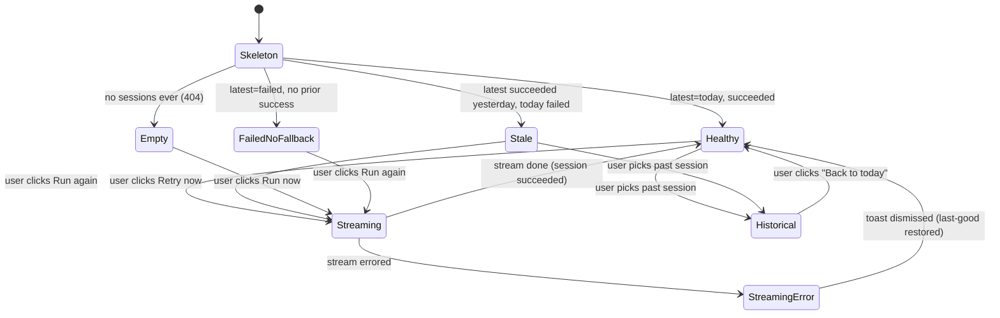

# UX Spec: AI Insights Tab — Automated Default Load

**Status:** Draft for review
**Owner:** Product Design (strategic-insights-tool)
**Companion docs:** `01-prd.md` (functional), `02-architecture.md` (system), `03-data-model.md` (schema)
**Date:** 2026-05-04
**Scope of this doc:** UX-only. No code. Implementation guidance for the React tab at `frontend/src/components/tabs/ai-insights/`.

---

## 0. Context recap (one paragraph)

Today the AI Insights tab is empty until the user clicks "Generate insights"; an SSE stream then populates cards live. After this feature lands, the tab will default to the latest auto-generated session produced by the 09:00 UTC daily cron, with citations to concrete underlying rows, an "ongoing" treatment for cross-day duplicates, and clear surfacing of failed runs. The manual button stays but is demoted from primary CTA to a secondary "Run again" affordance in the header. the user, the primary user, opens the tab once a morning before a meeting; nothing in this spec should cost him a click to see the day's narrative.

---

## 1. Information Architecture

### 1.1 Page hierarchy (top to bottom)

```
+------------------------------------------------------------------+
|  Page header                                                     |
|    - Title: "AI Insights"                                        |
|    - Subtitle / freshness: "Generated 6 minutes ago by daily     |
|      auto-run · 09:00 UTC"                                       |
|    - Source pill (auto-run vs manual)                            |
|    - Ongoing-count chip ("3 ongoing")                            |
|    - Right-aligned: secondary "Run again" button                 |
+------------------------------------------------------------------+
|  Conditional banner row (zero or one of:)                        |
|    - Stale-run / failed-today banner                             |
|    - Manual-run-failed toast (transient)                         |
|    - Web-search-unavailable banner (existing)                    |
|    - Historical-view indicator ("Viewing 2026-04-30")            |
+------------------------------------------------------------------+
|                                                                  |
|  Two-column body (existing 240px / 1fr grid)                     |
|                                                                  |
|  +-------------+   +------------------------------------------+  |
|  | Past        |   | Insight feed                             |  |
|  | sessions    |   |   - InsightCard (standard)               |  |
|  | rail        |   |   - InsightCard (ongoing variant)        |  |
|  |             |   |   - InsightCard (with chart)             |  |
|  | rows:       |   |   - InsightCard (supporting-rows panel)  |  |
|  |  date /     |   |   - ...                                  |  |
|  |  status /   |   |   - Footer: "Run completed 09:04 UTC,    |  |
|  |  count      |   |     7 insights, 23 citations"            |  |
|  +-------------+   +------------------------------------------+  |
+------------------------------------------------------------------+
```

The grid (`240px 1fr`) and the past-sessions left rail already exist in `AIInsightsTab.tsx`. We keep that skeleton and inject:

1. A new header right-rail (timestamp + source + ongoing chip + Run-again).
2. A banner slot above the body.
3. Real data in the past-sessions rail (it is currently hard-coded to an empty array).
4. New InsightCard variants (ongoing, supporting-rows expand) inside the existing card stream.

### 1.2 Default-load behavior

On tab mount:

1. Fire `GET /api/insights/latest` (single round-trip; expected p95 < 300ms because it is a DB read of a single session and its insights).
2. While in flight, render a **skeleton state** for the header (greyed timestamp) and three skeleton InsightCards in the feed — *not* a centered spinner.
3. On 200, hydrate the header and feed from the response.
4. On 404 (no session ever), render the **first-load empty state** (FR3 cold start).
5. On 5xx, render an error banner with a Retry button that re-fires the same `GET`. Do **not** fall back to the SSE stream — that is a different intent.

No SSE connection is opened on default load; the data is already-persisted.

### 1.3 "Run again" interaction

When the user clicks **Run again**:

1. The button enters its loading state ("Running..." with disabled visual).
2. `POST /api/insights/sessions` is fired (existing endpoint, but tagged `source=manual`).
3. On `{session_id}` returned, the existing SSE stream attaches via `useInsightStream` and the live-streaming card UI replaces the previously rendered cards.
4. On stream completion, the session becomes the new "latest" view. The header source pill flips from "Auto-run · 09:00 UTC" to "Manual run · just now".
5. On stream error, the previously rendered cards remain visible (we do not clobber a known-good snapshot with an error state) and an error toast appears.

The user's previously-loaded auto-run snapshot is **not** lost while a manual run is in flight; we hold it in memory and only swap it out when the new session reaches `done`.

---

## 2. Visual States

### 2.1 State table

| State | Trigger | Header | Banner | Body | Run-again button |
|---|---|---|---|---|---|
| **Skeleton** | Tab just mounted, fetch in flight | Skeleton timestamp + skeleton chip | none | 3 skeleton cards | disabled |
| **Empty / cold start** | `GET /latest` returns 404 (no sessions ever) | "No insights yet" + muted timestamp | none | Empty-state illustration + copy | **Promoted to primary** ("Run now") |
| **Healthy default** | Last successful run was today (within 24h) | Live timestamp + auto-run pill + ongoing chip | none | Hydrated InsightCards | secondary |
| **Stale default** | Today's run failed; latest succeeded run is yesterday's | Yesterday's timestamp + "auto-run" pill (greyed) | **Stale banner (warning)** | Yesterday's cards | secondary, with subtle pulse |
| **Failed-latest, no fallback** | Latest session is failed and there is no prior succeeded one | "Run failed" timestamp | **Error banner** | Empty + "View error" CTA | secondary |
| **Streaming (manual run)** | After Run again clicked | Live source pill flips to "Manual run · streaming" | none | Existing SSE card stream | "Running..." disabled |
| **Streaming error** | SSE manual run errored mid-stream | Header reverts to last-good snapshot | **Toast (transient, dismissible)** | Last-good cards remain | secondary, re-enabled |
| **Historical view** | User clicked a past session in the rail | Timestamp shows that session's date | **Historical indicator banner** ("Viewing 2026-04-30") | That session's cards (read-only) | hidden (replaced by "Back to today") |

### 2.2 State diagram (mermaid)



---

## 3. Component-Level Specs

### 3.1 Header bar

**Layout:** single horizontal row, vertically centered, wraps at narrow widths into a stack.

```
[Sparkles] AI Insights                                  [Run again]
   Generated 6 minutes ago by daily auto-run · 09:00 UTC
   [auto-run pill]  [3 ongoing]
```

**Fields, left to right:**

- **Title** — "AI Insights", `typography.title.fontSize + 4`, weight 700, `color.text.primary`. Unchanged.
- **Freshness line** — secondary text, `typography.body`, `color.text.caption`. Format: `"Generated <relative> by <source> · <absolute UTC>"`. Examples:
  - `"Generated 6 minutes ago by daily auto-run · 09:00 UTC"`
  - `"Generated yesterday by daily auto-run · 2026-05-03 09:00 UTC"` (when stale)
  - `"Generated just now by manual run · 14:32 UTC"` (when manual)
- **Source pill** — small pill, height 20px, padding 4px 8px, `radius.pill`. Two variants:
  - *Auto-run*: icon = clock/scheduler glyph (Lucide `Clock`), text "Auto-run", background `color.brand.tintDark`, foreground `color.brand.primaryHover`.
  - *Manual run*: icon = Lucide `Play`, text "Manual run", background `color.bg.surfaceAlt`, foreground `color.text.muted`.
- **Ongoing-count chip** — only renders when `ongoing_count > 0`. Format: `"<n> ongoing"`. Background `color.bg.surfaceAlt`, foreground `color.text.caption`. Clicking it scrolls the feed to the first ongoing card and briefly highlights it (300ms ring).
- **Run-again button** — right-aligned, see 3.5.

**Accessibility:** the relative timestamp ("6 minutes ago") gets an `aria-label` with the absolute UTC string ("Generated 2026-05-04 09:04 UTC by daily auto-run").

### 3.2 InsightCard variants

All variants share the existing card chrome (`bg.card`, 1px `border.default`, `radius.lg`, padding `s.s4`). Differences below.

#### 3.2.1 Standard (new today)

- Header: insight headline, weight 600.
- Body: 1–3 paragraphs of synthesized prose.
- Footer: citation chips (existing), supporting-rows toggle (NEW), confidence chip (existing).
- No special border treatment.

#### 3.2.2 Ongoing variant

Visual differentiation, *not* de-emphasis. the user needs to see that a story is durable; greying it out hides that signal.

- Top-left of the card: an **"Ongoing since MMM DD" pill**, background `color.bg.surfaceAlt`, foreground `color.semantic.info`, with a small Lucide `Repeat` icon. Tooltip: `"This insight has appeared every day since <date>. Click to see the original."`
- Left-edge accent: 3px solid bar in `color.semantic.info` (cyan), full card height. This is the *only* color difference.
- Card body unchanged (full opacity, full weight).
- Clicking the pill opens the original insight in the past-sessions historical view.

**Recommendation (resolves OQ in section 8):** Label, do not de-emphasize. Mute via opacity is the wrong call — ongoing stories are often the most strategically important.

#### 3.2.3 With chart (existing)

Unchanged. Ongoing + chart compose: a card can show both the left-edge cyan bar and the chart embed.

#### 3.2.4 With supporting-rows expand (NEW)

A new collapsible panel inside the card footer. Default collapsed.

- Trigger: text button `"Show supporting rows (n)"`, where `n` is the citation count. Lucide `ChevronDown` glyph, rotates on expand.
- Expanded panel: a compact table inside the card (not a drawer, not a modal — see 8.2 for rationale).
- Columns: `Source` | `Description` | `Value` | `Link`.
  - **Source**: short label, e.g. `power_deal`, `edgar_filing`, `permit`, `anomaly`. Monospaced, `color.text.faint`.
  - **Description**: human-readable row identifier, e.g. `"Meta x Constellation 2026-04-12 PPA"`, `"AMZN 10-K FY2025 §1A"`. Truncates with ellipsis at ~60 chars; full text in tooltip.
  - **Value**: the numeric or categorical value the insight cited, e.g. `1.2 GW`, `$3.4B`, `Approved`, `Anomaly score 0.91`. Right-aligned, monospaced.
  - **Link**: an external-link icon if a `source_url` exists (e.g. EDGAR accession URL, permit-system URL); otherwise empty.
- Row count: cap visible rows at 10. If more exist, append a footer row `"... and <k> more (see session detail)"` linking to a session detail page (out of v1 if not already built; treat as graceful degradation — disable the link).
- Empty state inside the table (defensive): `"No supporting rows recorded for this insight."` with a `color.semantic.warning` left bar — this should never happen in production but is a clear signal if it does.

### 3.3 Past sessions rail

The rail already exists in `AIInsightsTab.tsx` (left aside, 240px). It is currently fed an empty array. After this work it shows the **last 30 days** of sessions (FR4).

**Row anatomy:**

```
+----------------------------------------+
| 2026-05-04                 [✓]         |
| 7 insights · auto-run · 09:00          |
+----------------------------------------+
```

- **Date** (top line): `YYYY-MM-DD`, weight 500, `color.text.muted`. Today's row reads `"Today · 2026-05-04"`.
- **Status icon** (top-right): 14px square.
  - Succeeded: Lucide `Check` in `color.semantic.success`.
  - Failed: Lucide `AlertTriangle` in `color.semantic.danger`.
  - Stale (succeeded but >24h old at the time it was loaded): Lucide `Clock` in `color.text.faint`.
  - Partial (`succeeded_partial` per NFR1): Lucide `Check` in `color.semantic.warning`.
- **Meta line**: `"<n> insights · <source> · <HH:MM>"`. `color.text.faint`, 10px.
- **Active state**: left border 3px solid `color.brand.primary`, background `color.brand.tintDark` (matches existing rail pattern).
- **Hover**: background `color.bg.surfaceAlt`, cursor pointer.
- **Failed row**: insights count reads "—" rather than "0".

**Behaviour:**

- Clicking a row puts the main panel into Historical view (state from §2.1).
- Today's row, when clicked, returns to the live default view (and clears the historical banner).
- The rail is a single scroll container with `max-height: calc(100vh - 240px)`, native overflow.

**Recommendation on default state** (resolves §8.3): the rail stays **always visible** on desktop (this is a desktop-first internal tool with plenty of width). No collapse/expand control in v1; we revisit if the user complains it crowds the feed.

### 3.4 Failed-run banner

Renders only when the latest scheduled session for today is `failed` *and* a prior succeeded session is being shown as fallback. (If there is no fallback, see 3.4.2.)

#### 3.4.1 Stale banner (most common case)

```
+--------------------------------------------------------------+
| ⚠  Today's auto-run failed at 09:04 UTC — showing yesterday's |
|    insights.                          [View error] [Retry now]|
+--------------------------------------------------------------+
```

- Severity: **warning** (not error), because the user is not blocked — they have yesterday's data.
- Background: `color.bg.warningSubtle` (existing token, currently used for the web-search-unavailable banner — re-use, do not invent).
- Border: 1px `color.semantic.warning`.
- Icon: Lucide `AlertTriangle`, `color.semantic.warning`.
- Two CTAs:
  - **View error**: text link, opens an inline expand showing the failure reason (the `failure_reason` string from the AISession row).
  - **Retry now**: secondary button, identical visual to "Run again". Triggers a manual SSE run.
- Dismissible? No. The banner persists until either a successful run lands or the user navigates away from the tab.

#### 3.4.2 Hard error banner (no fallback)

When the latest session is `failed` and there is no prior `succeeded` session at all (cold start that errored on first try).

- Severity: **error**.
- Background: rgba(239,68,68,0.1) (derived from `color.semantic.danger`; treat as a new token if used twice — see §7).
- Copy: `"The most recent run failed at 09:04 UTC. No prior insights available. [View error] [Retry now]"`
- The body shows the empty-state illustration with a muted overlay.

#### 3.4.3 Failure reason copy

`failure_reason` strings come from the orchestrator and may be technical (e.g. `"oci_genai_rate_limited: 429 after 3 retries"`).

**Recommendation (resolves §8.4):** Show **both**. Default presentation is friendly (`"The model service was rate-limited. The next scheduled run will try again at 09:00 UTC tomorrow."`); a `<details>` element with the label "Technical details" reveals the raw string for engineers. Mapping from raw → friendly is a small lookup table maintained alongside the orchestrator. Unknown raw strings fall through to a generic friendly message: `"The run did not complete. The next scheduled run will try again at 09:00 UTC tomorrow."`

### 3.5 "Run again" button

- **Visual treatment:** secondary button. Border 1px `color.border.default`, background `color.bg.surfaceAlt`, foreground `color.text.body`, `radius.md`, height 32px, padding 0 12px. Lucide `RefreshCw` icon (14px) + label.
- **Placement:** top-right of the page header, vertically centered to the title row. On screens narrower than 720px it wraps below the title (still right-aligned).
- **Priority:** secondary, full stop. The primary visual emphasis on the page is the insight feed, not this button. Compare with the current `c.brand.primary` blue fill at line 154-169 in `AIInsightsTab.tsx`; that fill **is removed** in this design except in the cold-start empty state (where Run again is briefly the only meaningful action and earns primary treatment).
- **Idle label:** `"Run again"`.
- **Loading label:** `"Running..."`, button disabled, RefreshCw icon spins (`@keyframes` rotate, 1.5s linear infinite). No spinner-overlay needed.
- **Disabled label:** `"Run again"`, opacity 0.5, cursor `not-allowed`. Disabled when an SSE stream is currently in flight.
- **Confirmation:** none. A single click kicks off the SSE manual run. Insight runs are cheap relative to user friction; a confirm modal would punish the most engaged user.
- **Tooltip on hover** (delay 400ms): `"Force a fresh run now. The next auto-run is scheduled for 09:00 UTC."`

### 3.6 Historical-view indicator

A thin, dismissible-but-recurring banner shown when the user is viewing a past session:

```
+--------------------------------------------------------------+
| ⏱  Viewing 2026-04-30 (4 days ago) · auto-run · read-only    |
|                                            [Back to today]   |
+--------------------------------------------------------------+
```

- Background: `color.brand.tintDark`.
- Border: 1px `color.brand.primary`.
- Foreground: `color.text.body`.
- Single CTA "Back to today" returns to default-load.
- Read-only effect on the feed: the supporting-rows expand still works; the Run again button is hidden (replaced by "Back to today" duplication is fine — header keeps its own copy too).

### 3.7 Empty state (cold start)

```
                        [Sparkles glyph, 48px, faint]

                   No insights generated yet.
        The first daily run is scheduled for tomorrow 09:00 UTC.

                          [ Run now ]
                  (secondary text below button:)
                "Or wait for the scheduled run."
```

- Centered in the main panel area.
- Run now button is **primary** here (only place in this spec where it is).
- Past-sessions rail in this state shows the existing `"No past sessions yet."` muted text.

---

## 4. Interaction Flows

### 4.1 Flow 1 — the user opens the tab in the morning, healthy path

```
User                 Tab                          API
 |                    |                            |
 | clicks "AI         |                            |
 | Insights"          |                            |
 |------------------->|                            |
 |                    | render skeleton            |
 |                    | GET /api/insights/latest   |
 |                    |--------------------------->|
 |                    |    200 { session, insights }
 |                    |<---------------------------|
 |                    | hydrate header + feed      |
 |  sees fresh        |                            |
 |  insights <500ms   |                            |
 |<-------------------|                            |
```

Steps:

1. Tab mounts.
2. Skeleton header + 3 skeleton cards render immediately.
3. `GET /api/insights/latest` fires.
4. On 200, header populates with timestamp + auto-run pill + ongoing chip; insight feed renders cards including ongoing variants.
5. No banner shows. the user reads.

### 4.2 Flow 2 — Today's run failed, user retries

```
1. Tab mounts.
2. Skeleton renders.
3. GET /api/insights/latest returns yesterday's session (latest succeeded).
4. Tab also calls GET /api/insights/sessions?date=today (or the latest endpoint
   includes today's failed session in the response envelope; architect's call).
5. Stale banner renders above the feed. Yesterday's cards render in the feed.
6. User clicks "Retry now".
7. POST /api/insights/sessions { source: "manual" } → { session_id }.
8. SSE attaches; banner stays visible (still showing yesterday's situation) but
   the feed transitions to the streaming UI.
9. On stream done, banner clears, header source pill flips to "Manual run · just now",
   feed shows new session's cards.
10. Past-sessions rail gets a new "Today" row at the top with status check.
```

### 4.3 Flow 3 — Browse a past session

```
1. User clicks a row in the past-sessions rail (e.g. 2026-04-30).
2. GET /api/insights/sessions/{id} fires.
3. While in flight, feed enters skeleton state (header keeps its current values
   greyed slightly to signal transition).
4. On 200, header timestamp updates to the historical session's timestamp,
   "Historical-view indicator" banner appears, feed shows that session's cards.
5. Run-again button is hidden; "Back to today" appears in the indicator banner.
6. User clicks "Back to today" → re-fires GET /api/insights/latest, transitions
   back to whatever default state applies (healthy / stale / failed).
```

### 4.4 Flow 4 — Expand supporting rows

```
1. User clicks "Show supporting rows (5)" on an InsightCard.
2. ChevronDown rotates 180deg (200ms ease).
3. The supporting-rows table animates open inline (height: auto, 200ms ease).
4. Table renders 5 rows with Source / Description / Value / Link columns.
5. User can click an external-link icon to open the source (EDGAR, permit
   system) in a new tab. rel="noopener noreferrer".
6. Click the trigger again to collapse.
```

**Why inline-expand and not drawer/modal** (resolves §8.2):

- Inline expand keeps the user's place in the feed; they do not lose scroll context.
- The cited rows are short (a handful of fields each). They do not need a full-height drawer.
- A modal would imply heavyweight inspection; this is "show me the receipts", not "explore the data".
- Drawers conflict with the existing left-rail (past sessions) in a 1280px-max layout — we would have a left rail, a center feed, and a right drawer simultaneously.

If a future story needs deeper exploration (cross-row linking, query-by-citation), that earns a drawer or a session-detail page. v1 inline.

---

## 5. Copy Deck

All strings are exact. Sentence case throughout. No exclamation marks. No emoji.

### 5.1 States

- **Healthy header freshness** (relative): `"Generated {relative} by daily auto-run · {HH:MM} UTC"`
- **Healthy header freshness** (absolute, on hover/SR): `"Generated {YYYY-MM-DD} {HH:MM} UTC by daily auto-run"`
- **Manual freshness**: `"Generated {relative} by manual run · {HH:MM} UTC"`
- **Skeleton placeholder text** (visually hidden, for screen readers): `"Loading the most recent insight session."`
- **Empty state (first-ever load)**:
  - Title: `"No insights generated yet."`
  - Body: `"The first daily run is scheduled for tomorrow 09:00 UTC."`
  - Button: `"Run now"`
  - Sub-button caption: `"Or wait for the scheduled run."`

### 5.2 Stale / failure banners

- **Stale banner**: `"Today's auto-run failed at {HH:MM} UTC — showing yesterday's insights."`
- **Stale banner CTAs**: `"View error"` / `"Retry now"`
- **Hard-error banner (no fallback)**: `"The most recent run failed at {HH:MM} UTC. No prior insights available."`
- **Friendly failure reasons** (mapping table — extend in code as new error classes appear):
  - `oci_genai_rate_limited` → `"The model service was rate-limited. The next scheduled run will try again at 09:00 UTC tomorrow."`
  - `wall_clock_exceeded` → `"The run took longer than its time budget. The next scheduled run will try again at 09:00 UTC tomorrow."`
  - `db_timeout` → `"The database was unavailable when the run started. The next scheduled run will try again at 09:00 UTC tomorrow."`
  - default → `"The run did not complete. The next scheduled run will try again at 09:00 UTC tomorrow."`
- **Technical details disclosure label**: `"Technical details"` (HTML `<details>` summary)

### 5.3 Run-again button

- **Idle**: `"Run again"`
- **Loading**: `"Running..."`
- **Disabled (stream already in flight)**: `"Run again"` (visually disabled; tooltip `"A run is already in progress."`)
- **Cold-start primary variant**: `"Run now"`
- **Tooltip (idle)**: `"Force a fresh run now. The next auto-run is scheduled for 09:00 UTC."`

### 5.4 Insight card

- **Ongoing-since pill**: `"Ongoing since {MMM D}"`
- **Ongoing-since tooltip**: `"This insight has appeared every day since {YYYY-MM-DD}. Click to see the original."`
- **Supporting-rows section title (collapsed)**: `"Show supporting rows ({n})"`
- **Supporting-rows section title (expanded)**: `"Hide supporting rows"`
- **Supporting-rows empty defensive copy**: `"No supporting rows recorded for this insight."`
- **Supporting-rows overflow row**: `"... and {k} more"`

### 5.5 Past sessions rail

- **Heading**: `"Past sessions"` (existing micro caption)
- **Empty state**: `"No past sessions yet."` (existing)
- **Today's row date prefix**: `"Today · "`
- **Yesterday's row date prefix**: `"Yesterday · "`
- **Failed row meta**: `"Run failed · auto-run · {HH:MM}"`
- **Partial row meta**: `"{n} insights · auto-run · partial · {HH:MM}"`

### 5.6 Historical view

- **Indicator banner**: `"Viewing {YYYY-MM-DD} ({n} days ago) · {source} · read-only"`
- **Indicator CTA**: `"Back to today"`

### 5.7 Toasts (transient)

- **Manual run errored**: `"Run failed: {short reason}. Your previous insights are still shown."` — auto-dismisses after 8s; has a manual close.
- **Manual run succeeded**: no toast (the UI itself updating is the confirmation).

### 5.8 Tone notes

- the user reads in the morning before a meeting. Zero tolerance for cute copy.
- All times in UTC. No localized formats.
- Numbers always with units (`1.2 GW`, not `1.2`).
- Never say "Sorry". Never say "Oops".
- Never use "we" (the tool is a viewer, not a person).

---

## 6. Accessibility

### 6.1 Keyboard navigation

Tab order, top to bottom, left to right:

1. Tab navigation (existing global nav, out of scope here).
2. Page header `h1` (focusable for screen readers via `tabIndex={-1}` + `id="ai-insights-heading"` for skip-link target).
3. Source pill (if interactive — for now it is decorative; not in tab order).
4. Ongoing-count chip (interactive, scrolls feed; in tab order).
5. **Run-again button** — must be reachable in 4 tabs from page focus.
6. Banner CTAs ("View error", "Retry now") — only when banner is rendered.
7. Each past-sessions rail row (already a `button`).
8. Each InsightCard's interactive elements (citation chips, supporting-rows toggle, ongoing pill, chart legend if present).

### 6.2 Focus rings

- Use `outline: 2px solid {color.brand.primaryHover}; outline-offset: 2px` on `:focus-visible` for every interactive element.
- The supporting-rows toggle, the ongoing pill, and the past-sessions rows all need explicit focus-visible styling. Do not rely on default browser outlines.

### 6.3 Screen-reader text

- **Freshness**: `aria-label="Generated 2026-05-04 09:04 UTC by daily auto-run, 6 minutes ago."` on the freshness span. Visible text uses the relative form; SR text uses the full absolute UTC form.
- **Source pill**: `aria-label="Source: daily auto-run."` (no "pill" or visual descriptors).
- **Ongoing chip**: `aria-label="3 insights are ongoing from previous runs. Activate to scroll to the first."`
- **Ongoing pill on a card**: `aria-label="This insight has appeared every day since May 1, 2026."`
- **Status icon in past-sessions row**: `aria-label="Succeeded"` / `"Failed"` / `"Partial"` / `"Stale"` (the icon itself uses `aria-hidden="true"`).
- **Run-again button (loading)**: `aria-busy="true"`, `aria-label="Running..."`.
- **Stale banner**: wrap in `role="status"` (polite). The hard-error variant uses `role="alert"` (assertive).
- **Historical indicator**: `role="status"` (polite). The banner's `aria-live="polite"` ensures the SR announces the date when the user enters historical mode.

### 6.4 Color contrast

Verify against WCAG AA (4.5:1 for body, 3:1 for large text and UI components). Pre-checked pairs:

| Pair | Hex | Ratio | Pass |
|---|---|---|---|
| `text.body` on `bg.card` | `#e2e8f0` on `#1e293b` | 11.6:1 | AAA |
| `text.caption` on `bg.page` | `#94a3b8` on `#0f172a` | 6.0:1 | AA body, AAA large |
| `semantic.warning` on `bg.warningSubtle` | `#f59e0b` on `#1e1b14` | 8.0:1 | AAA |
| `semantic.danger` on derived danger-subtle | `#ef4444` on `~#1f1414` | ~6.5:1 | AA |
| `semantic.info` on `bg.surfaceAlt` (ongoing pill) | `#06b6d4` on `#162032` | 5.7:1 | AA |
| `brand.primaryHover` (focus ring) on `bg.page` | `#60a5fa` on `#0f172a` | 6.7:1 | AAA |

All status pills must meet 3:1 against their background; the table above confirms.

### 6.5 Motion

Honor `prefers-reduced-motion`:

- Disable the RefreshCw spin on the loading button (replace with a static icon and rely on `aria-busy`).
- Disable the supporting-rows expand height transition (just toggle `display`).
- Disable the skeleton shimmer (already a token: `motion.skeletonAnimation`; gate with the media query at the CSS layer).
- The 300ms ring on ongoing-chip-click stays — it is a discrete brief affordance, not continuous motion.

---

## 7. Design Tokens / Styles

### 7.1 Reuse (no new tokens needed for these)

- Backgrounds: `bg.page`, `bg.card`, `bg.surfaceAlt`, `bg.warningSubtle` (re-used for the stale banner — same intent as the existing web-search-unavailable banner).
- Borders: `border.default`, `border.weak`, `border.strong`.
- Text: `text.primary`, `text.body`, `text.muted`, `text.caption`, `text.faint`.
- Brand: `brand.primary`, `brand.primaryHover`, `brand.tintDark` (re-used for active rail row + historical-view banner).
- Semantic: `semantic.success`, `semantic.warning`, `semantic.danger`, `semantic.info`.
- Radii: `radius.md` (button), `radius.lg` (card), `radius.pill` (pills/chips).
- Spacing: `s.s2` through `s.s6` are sufficient for everything in this spec.
- Typography: existing scale covers all needs.

### 7.2 New tokens to add

| Token | Value | Used for |
|---|---|---|
| `color.bg.dangerSubtle` | `#1f1414` (matches warningSubtle pattern) | Hard-error banner background |
| `color.bg.infoSubtle` | `#0f1f24` (matches pattern) | Ongoing pill background, historical-view secondary |
| `color.semantic.ongoing` | alias of `semantic.info` (`#06b6d4`) | Semantic alias to avoid leaking "info" into the codebase as if it were generic |
| `motion.iconSpin` | `"insightIconSpin 1.5s linear infinite"` | Run-again loading icon |

The two `*Subtle` tokens follow the established `bg.warningSubtle` pattern from the existing audit. The `motion.iconSpin` is paired with a `@keyframes insightIconSpin { to { transform: rotate(360deg); } }` declaration in the existing styles entry point.

### 7.3 Icons

All icons are from Lucide (already a project dependency — `Sparkles` and `X` are imported in `AIInsightsTab.tsx` today). No new icon assets.

| Use | Lucide name |
|---|---|
| Auto-run source pill | `Clock` |
| Manual-run source pill | `Play` |
| Run-again button | `RefreshCw` |
| Ongoing-since pill | `Repeat` |
| Supporting-rows toggle (collapsed) | `ChevronDown` |
| Supporting-rows toggle (expanded) | `ChevronUp` |
| External link in supporting rows | `ExternalLink` |
| Stale / failed banner | `AlertTriangle` |
| Past-sessions success | `Check` |
| Past-sessions failed | `AlertTriangle` |
| Past-sessions stale | `Clock` |
| Historical-view banner | `History` |

All icons render at 14px in body context, 18–20px in header context, 48px in empty-state hero.

---

## 8. Open Design Questions (with recommendations)

Each open question is answered here with a recommendation; final sign-off rests with the PM and the user.

### 8.1 Should "ongoing" insights be visually de-emphasized or just labeled?

**Recommendation: label, do not de-emphasize.**

Ongoing insights are often the most strategically important — a hyperscaler signing a third nuclear PPA is more newsworthy than the first. Greying them out actively misleads the reader. We use a left-edge cyan accent + an "Ongoing since" pill to signal continuity, while keeping the card body at full opacity and full contrast. If the user tells us the feed feels repetitive, we can tighten the dedup threshold (FR7 / OQ5) rather than visually muting.

### 8.2 Where do supporting rows live — inline expand, drawer, or modal?

**Recommendation: inline expand inside the InsightCard.**

See 4.4 for full rationale. Short version: the user is doing receipts-checking, not exploration; they should not lose scroll context; the layout already has a left rail that conflicts with a right drawer.

If a later release needs richer row inspection (cross-row joins, ad-hoc query), promote to a session-detail page rather than a transient drawer.

### 8.3 Past-sessions panel: open by default, collapsed, or behind a button?

**Recommendation: always-visible left rail (current behavior).**

This is a desktop-first internal tool with a 1280px max content width. The 240px rail does not crowd the feed at any reasonable resolution. Hiding it behind a button costs the user a click for a feature he will use daily ("what did the tool say yesterday before our exec sync?").

If we ever ship a mobile variant (out of scope per §10), the rail collapses into a Sheet / bottom-drawer — but not in v1.

### 8.4 Failed-run banner: surface raw error string or friendly message?

**Recommendation: show both. Default to friendly; reveal raw via `<details>` "Technical details".**

See §3.4.3 and §5.2. the user does not want to read `oci_genai_rate_limited: 429 after 3 retries` in the morning. The on-call engineer does. A `<details>` block satisfies both audiences without adding a separate page or a modal.

The friendly-message mapping table is small (3–6 entries to start) and lives next to the orchestrator's named error types. New entries get added when new error classes appear — this is a small ongoing maintenance task, not a design system commitment.

---

## 9. Wireframes

### 9.1 Wireframe 1 — Healthy default load

```
+----------------------------------------------------------------------------+
|  Top tab nav: [Power] [Permits] [Filings] [AI Insights*] [Sources]         |
+----------------------------------------------------------------------------+
|                                                                            |
|  * AI Insights                                                 [Run again] |
|    Generated 6 minutes ago by daily auto-run · 09:00 UTC                   |
|    [Clock-pill: Auto-run]   [3 ongoing]                                    |
|                                                                            |
+----------------------------------------------------------------------------+
|                                                                            |
| +-----------------+  +----------------------------------------------------+|
| | PAST SESSIONS   |  | Headline 1: Meta extends nuclear footprint with    ||
| |                 |  | second Constellation PPA                            ||
| | Today           |  |                                                    ||
| | 2026-05-04   ✓  |  | Body prose, two paragraphs grounded in real data.  ||
| | 7 ins · 09:00   |  |                                                    ||
| | --------------- |  | [citation: deal_4821] [citation: 8-K acc#0001..]   ||
| |                 |  | [Show supporting rows (4)]      [confidence: high] ||
| | Yesterday       |  +----------------------------------------------------+|
| | 2026-05-03   ✓  |                                                       |
| | 6 ins · 09:00   |  +----------------------------------------------------+|
| |                 |  | [Repeat] Ongoing since May 1                       ||
| | 2026-05-02   ✓  |  | Headline 2: Microsoft permit cadence in Loudoun    ||
| | 7 ins · 09:00   |  | County trending +30% MoM                           ||
| |                 |  |                                                    ||
| | 2026-05-01   ⚠  |  | Body prose ...                                     ||
| | failed · 09:04  |  |                                                    ||
| |                 |  | [citation: permit_882] [citation: permit_901]      ||
| | 2026-04-30   ✓  |  | [Show supporting rows (5)]    [confidence: medium] ||
| | 5 ins · 09:00   |  +----------------------------------------------------+|
| |       [^ accent: cyan left-edge bar marks ongoing]                       |
| | ...             |                                                        |
| +-----------------+  ... more cards ...                                    |
|                                                                            |
+----------------------------------------------------------------------------+
```

### 9.2 Wireframe 2 — Stale state with failed-run banner

```
+----------------------------------------------------------------------------+
|  * AI Insights                                                 [Run again] |
|    Generated yesterday by daily auto-run · 2026-05-03 09:00 UTC            |
|    [Clock-pill: Auto-run (greyed)]   [2 ongoing]                           |
|                                                                            |
+----------------------------------------------------------------------------+
|  ⚠  Today's auto-run failed at 09:04 UTC — showing yesterday's insights.   |
|                                                  [View error] [Retry now]  |
+----------------------------------------------------------------------------+
|                                                                            |
| +-----------------+  +----------------------------------------------------+|
| | PAST SESSIONS   |  | Headline 1: ...(yesterday's session's insights)... ||
| |                 |  +----------------------------------------------------+|
| | Today           |                                                       |
| | 2026-05-04   ⚠  |  +----------------------------------------------------+|
| | failed · 09:04  |  | Headline 2: ...                                    ||
| |                 |  +----------------------------------------------------+|
| | Yesterday  *    |                                                       |
| | 2026-05-03   ✓  |  ... more cards from yesterday ...                    |
| | 6 ins · 09:00   |                                                       |
| |  [active row]   |                                                       |
| | ...             |                                                       |
| +-----------------+                                                       |
+----------------------------------------------------------------------------+
```

### 9.3 Wireframe 3 — Insight card with supporting-rows expanded

```
+----------------------------------------------------------------------------+
| Headline 1: Meta extends nuclear footprint with second Constellation PPA   |
|                                                                            |
| Meta announced a second long-term PPA with Constellation Energy on         |
| 2026-04-12, totaling 1.2 GW for delivery starting 2027. Combined with      |
| the Calpine deal earlier this year, Meta's contracted nuclear capacity     |
| now exceeds Microsoft's by approximately 800 MW.                           |
|                                                                            |
| [deal_4821]  [deal_4790]  [8-K acc#0001..]                                 |
|                                                                            |
| [^ Hide supporting rows]                              [confidence: high]   |
| +------------------------------------------------------------------------+ |
| | Source         | Description                    | Value     | Link    | |
| |----------------+--------------------------------+-----------+---------| |
| | power_deal     | Meta x Constellation 2026-04-12| 1.2 GW    | [open] | |
| | power_deal     | Meta x Calpine 2026-01-30       | 0.8 GW    | [open] | |
| | edgar_filing   | META 8-K 0001628280-26-000142   | section 8 | [open] | |
| | power_deal     | MSFT x Constellation 2024-09-20 | 0.835 GW  | [open] | |
| +------------------------------------------------------------------------+ |
+----------------------------------------------------------------------------+
```

### 9.4 Wireframe 4 — Past sessions selected, historical view

```
+----------------------------------------------------------------------------+
|  * AI Insights                                          [Back to today]    |
|    Generated 2026-04-30 by daily auto-run · 09:00 UTC                      |
|    [Clock-pill: Auto-run]   [1 ongoing]                                    |
|                                                                            |
+----------------------------------------------------------------------------+
|  ⏱  Viewing 2026-04-30 (4 days ago) · auto-run · read-only                 |
|                                                       [Back to today]      |
+----------------------------------------------------------------------------+
|                                                                            |
| +-----------------+  +----------------------------------------------------+|
| | PAST SESSIONS   |  | Headline (from the historical session)             ||
| |                 |  |                                                    ||
| | Today           |  | Body prose ...                                     ||
| | 2026-05-04   ✓  |  | [citations] [Show supporting rows (3)]             ||
| |                 |  +----------------------------------------------------+|
| | Yesterday       |                                                       |
| | 2026-05-03   ✓  |  +----------------------------------------------------+|
| |                 |  | (more cards from 2026-04-30) ...                   ||
| | 2026-05-02   ✓  |  +----------------------------------------------------+|
| |                 |                                                       |
| | 2026-05-01   ⚠  |                                                       |
| |                 |                                                       |
| | 2026-04-30   ✓ *|  [* selected; cyan left border + tinted background]   |
| |  [active]       |                                                       |
| | ...             |                                                       |
| +-----------------+                                                       |
+----------------------------------------------------------------------------+
```

---

## 10. Out of Scope (explicit)

These are not part of v1 and should not be designed-around:

- **Notification system.** No email digest, no push, no Slack post, no in-app toast for newly-arrived auto-runs. the user visits the tab; the tab tells him.
- **Mobile layout.** This is a desktop-first internal tool. Responsiveness below 720px wraps the header but is not laid out below tablet. No phone optimization.
- **Theming.** No light theme, no high-contrast theme. The existing dark palette (`bg.page = #0f172a`) is the only theme. Two `*Subtle` token additions are functional, not theme-based.
- **Localization.** UTC only. English only. Numeric formats fixed (no per-locale decimal separator).
- **Custom date range / filter on past sessions.** v1 shows the last 30 days, ordered DESC. No date picker, no source filter, no insight-count filter.
- **Sharing / export.** No "copy link to this session", no PDF export, no clipboard insight-card. v1 is read-only consumption inside the tab.
- **Comparison view.** No side-by-side of two sessions. The historical view is single-session only.
- **In-card editing or annotation.** the user cannot mark an insight as "read", "wrong", or "important" in v1. (FR7 dedup is the only signal of insight identity over time, and it is automatic.)
- **Deep-link to a specific insight.** URLs do not currently encode session id + insight anchor. v1 accepts that; if needed, a future story adds `/ai-insights?session={id}#insight={id}`.
- **Settings.** No toggle for "show ongoing", "show citations", or "auto-refresh interval". The behavior is fixed.

---

## 11. Implementation notes for the developer

A short list of pointers so this doc translates without guesswork. These are not design decisions — they are nudges so the implementation matches the spec.

- The header right-rail (timestamp + pills + Run-again) is a new component; name suggestion `InsightHeaderMeta`. It receives `{ generatedAt, source, ongoingCount, onRunAgain, runState }` and is the only place that knows about the source pill / freshness formatting.
- The freshness relative-time formatting should re-use whatever helper formats relative times elsewhere in the app; if none exists, a small `formatRelativeUTC(date)` helper is sufficient (no `date-fns` dependency needed for "X minutes ago" / "yesterday" / "N days ago").
- The past-sessions rail is currently fed an empty array literal in `AIInsightsTab.tsx`. Wire it to a new API client call (`GET /api/insights/sessions?limit=30`); shape per `02-architecture.md` once that doc lands.
- The supporting-rows table is small enough to render inline without virtualization. Cap rendered rows at 10 per spec §3.2.4; do not prematurely optimize.
- Skeleton shimmer reuses the existing `motion.skeletonAnimation` token; do not create a new shimmer.
- The web-search-unavailable banner already in the file (lines 179-220) is unrelated to this work and should be left alone; the new stale-run banner sits **above** it when both apply.
- The "Generate insights" button at lines 154-169 is the one that gets demoted to "Run again" and moved into `InsightHeaderMeta`. Its current `c.brand.primary` fill is removed (per §3.5).

---

## 12. Sign-off checklist

Before a developer picks this up:

- [ ] PM confirms the recommendations in §8.1, §8.2, §8.3, §8.4.
- [ ] PM confirms the friendly-failure mapping table in §5.2 is acceptable as a starting set.
- [ ] Architect confirms `GET /api/insights/latest` exists or is in the implementation plan, and that its response includes today's failed-session metadata when applicable (needed for the stale banner).
- [ ] Architect confirms the `ongoing` flag and `ongoing_since` date are present on the `AIInsight` rows returned by the latest/sessions endpoints.
- [ ] the user confirms the tone in §5 (concise, factual, executive) is what he wants in the morning.

---

*End of UX spec.*
